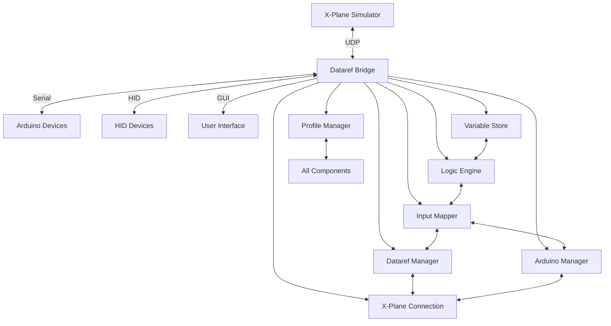

# X-Plane Dataref Bridge - Comprehensive Codebase Documentation

## Table of Contents
1. [Project Overview](#project-overview)
2. [Project Structure](#project-structure)
3. [Architecture & Data Flow](#architecture--data-flow)
4. [Core Components](#core-components)
5. [User Interface](#user-interface)
6. [Configuration & Data](#configuration--data)
7. [Hardware Integration](#hardware-integration)
8. [Build & Distribution](#build--distribution)
9. [Documentation](#documentation)
10. [Development Workflow](#development-workflow)
11. [Performance Considerations](#performance-considerations)
12. [Security Considerations](#security-considerations)
13. [Troubleshooting](#troubleshooting)
14. [Development Guidelines](#development-guidelines)
15. [Extensibility Guide](#extensibility-guide)
16. [API Reference](#api-reference)
17. [Testing Strategy](#testing-strategy)
18. [Deployment Guide](#deployment-guide)
19. [Migration Guide](#migration-guide)

## Project Overview

X-Plane Dataref Bridge is a cross-platform application that serves as a bridge between X-Plane flight simulator and external hardware devices (Arduino, HID devices). The application enables cockpit builders to create physical controls that interact with X-Plane through datarefs and commands.

The project is built using Python with PyQt6 for the GUI, and supports communication with X-Plane via UDP and with Arduino/ESP32 devices via serial communication. It provides a comprehensive solution for creating custom hardware cockpits with authentic instruments, switches, and controls that interact with X-Plane in real-time.

### Key Features
- **Hardware Support:** Arduino devices with custom firmware, standard HID devices (joysticks, game controllers), and hybrid mode for ESP32-S2/S3 devices
- **Profile-based Configuration:** Save and load different configurations for various aircraft
- **Real-time Communication:** Bidirectional communication with X-Plane via UDP protocol
- **Logic Engine:** Create virtual variables with conditional logic
- **Input Mapping:** Map physical inputs to X-Plane actions with advanced options
- **Output Management:** Route X-Plane dataref updates to hardware outputs
- **Array Handling:** Support for array datarefs with element-specific operations
- **Variable System:** Unified variable system for custom values and logic
- **Auto-discovery:** Automatic detection of X-Plane and connected devices

## Project Structure

```
XPDRB_branch1/
├── Arduino libraries/           # Arduino library files
├── config/                     # Configuration files
│   ├── profiles/               # Saved profiles
│   ├── custom_datarefs.json    # Custom dataref definitions
│   ├── input_mappings.json     # Input mapping configurations
│   └── settings.json           # Application settings
├── core/                       # Core application logic
│   ├── arduino/                # Arduino communication modules
│   ├── bridge/                 # Bridge communication logic
│   ├── hid/                    # HID device management
│   ├── dataref_manager.py      # Dataref management
│   ├── dataref_writer.py       # Dataref writing utilities
│   ├── hid_manager.py          # HID device manager
│   ├── input_mapper.py         # Input mapping logic
│   ├── logic_engine.py         # Logic engine for conditional operations
│   ├── logic_library.py        # Logic operations library
│   ├── profile_manager.py      # Profile management
│   ├── variable_store.py       # Variable storage system
│   └── xplane_connection.py    # X-Plane communication
├── docs/                       # Documentation files
├── examples/                   # Example configurations and Arduino sketches
│   └── arduino/                # Arduino example sketches
│       ├── Advanced_Hybrid/
│       ├── Basic_Template/
│       ├── Byte_Arrays_with_OUTPUT_IDs/
│       ├── Complete_Dataref_Reference/
│       ├── General_Encoder_With_Output/
│       ├── Handling_FloatOrInt_Arrays_w_OUTPUT_IDs/
│       ├── Handling_X-Plane_Dataref_Types_with_OUTPUT_IDs/
│       ├── Input_Examples/
│       └── Output_Examples/
├── gui/                        # PyQt6 GUI components
│   ├── widgets/                # Custom GUI widgets
│   ├── arduino_panel.py        # Arduino device panel
│   ├── axis_calibration_wizard.py # Calibration wizard
│   ├── custom_dataref_dialog.py # Custom dataref dialog
│   ├── dataref_editor_dialog.py # Dataref editor dialog
│   ├── dataref_panel.py        # Dataref panel
│   ├── dataref_search_dialog.py # Dataref search dialog
│   ├── firmware_panel.py       # Firmware panel
│   ├── hat_switch_widget.py    # Hat switch widget
│   ├── help_panel.py           # Help panel
│   ├── hid_panel.py            # HID device panel
│   ├── input_mapping_dialog.py # Input mapping dialog
│   ├── input_panel.py          # Input configuration panel
│   ├── logic_schematic_widget.py # Logic schematic widget
│   ├── main_window.py          # Main application window
│   ├── monitor_panel.py        # Monitor panel
│   ├── output_panel_array_edit.py # Output panel array editor
│   ├── output_panel.py         # Output configuration panel
│   ├── settings_panel.py       # Settings panel
│   └── variable_dialog.py      # Variable dialog
├── resources/                  # Icons and assets
├── scripts/                    # Build and utility scripts
│   ├── Output/
│   ├── build_package.py        # Package building script
│   ├── convert_datarefs.py     # Dataref conversion script
│   ├── installer_setup.iss     # Installer setup script
│   └── integrate_datarefs.py   # Dataref integration script
├── tests/                      # Unit tests
├── tools/                      # Utility tools
├── utils/                      # Utility functions
├── main.py                     # Application entry point
├── README.md                   # Project documentation
├── requirements.txt            # Python dependencies
└── datarefcommands_database.json # X-Plane dataref and command database
```

## Architecture & Data Flow

### System Architecture

The X-Plane Dataref Bridge follows a modular architecture with clear separation of concerns:



### Data Flow

#### Input Flow (Hardware → X-Plane)
1. Physical input occurs (button press, encoder rotation, etc.)
2. Hardware device sends INPUT command via serial: `INPUT <KEY> <VALUE>`
3. Arduino Manager receives and parses the message
4. Arduino Manager emits input event to Input Mapper
5. Input Mapper evaluates conditional logic and mappings
6. Input Mapper sends appropriate dataref write or command execution to X-Plane Connection
7. X-Plane Connection sends UDP packet to X-Plane
8. X-Plane processes the input

#### Output Flow (X-Plane → Hardware)
1. X-Plane sends dataref updates via UDP (RREF packets)
2. X-Plane Connection receives and parses the data
3. X-Plane Connection notifies Dataref Manager of updates
4. Dataref Manager checks for universal mappings
5. If universal mapping exists, Arduino Manager broadcasts to all connected devices
6. Arduino Manager sends SET command to hardware: `SET <KEY> <VALUE>`
7. Hardware receives and processes the command

#### Array Data Flow
1. Array datarefs are parsed with `parse_array_type()` method
2. Multidimensional arrays are flattened using row-major order
3. Element indices are generated with `_generate_element_indices()`
4. Individual elements can be accessed via `[index]` notation
5. Array updates can be sent as comma-separated values for bulk operations

### Timing and Synchronization
- X-Plane dataref updates typically occur at 10Hz (configurable)
- Arduino serial communication operates at 115200 baud
- Input events are processed immediately upon receipt
- Output updates are throttled to prevent spam with caching mechanism
- Logic engine processes at 100ms intervals (10Hz)

## Core Components

### Arduino Communication (core/arduino/)

#### arduino_manager.py
**Purpose:** Manages Arduino/ESP32 device connections and communication. Supports Universal Mapping (Dataref -> Key Broadcast).

**Key Functions:**
- Device discovery and connection management
- Serial communication handling with proper error handling for PyInstaller
- Protocol message parsing and routing
- Input/output routing with caching to avoid spam
- Universal mapping system for broadcasting data to all devices
- Handshake protocol implementation
- Device state management

**Important Methods:**
- `connect_to_device()`: Establishes connection to Arduino device
- `send_output()`: Sends output commands to Arduino device
- `process_input()`: Processes incoming input from Arduino device
- `broadcast_by_key()`: Sends data to all devices registered for a specific key
- `set_universal_mapping()`: Register a mapping from a source (dataref or variable) to a universal key
- `on_dataref_update()`: Called when a dataref value changes, broadcasts to all devices if a universal mapping exists
- `_device_loop()`: Main communication loop for a device
- `_perform_handshake()`: Perform handshake with device
- `_process_incoming()`: Process incoming messages from device
- `_handle_input()`: Handle INPUT message from device
- `_handle_dref()`: Handle DREF message from device to set dataref value
- `_handle_cmd()`: Handle CMD message from device to send X-Plane command

#### arduino_device.py
**Purpose:** Represents a single Arduino device with state management.

**Key Attributes:**
- Device identification (name, type, firmware version)
- Connection status and state management
- Input/output capabilities
- Subscription tracking
- Last seen timestamp

**Important Methods:**
- `handshake()`: Performs initial handshake with device
- `send_command()`: Sends commands to device
- `parse_message()`: Parses incoming messages from device
- `transition()`: Changes device state with validation
- `set_input()`: Updates input value for the device

### X-Plane Communication (core/xplane_connection.py)
**Purpose:** Manages UDP communication with X-Plane

**Key Functions:**
- Connection management (connect/disconnect)
- Dataref subscription and value updates
- Command execution
- Version detection
- Beacon listening for auto-discovery
- Array dataref handling
- String dataref writing

**Important Methods:**
- `connect()`: Establishes connection to X-Plane
- `subscribe_dataref()`: Subscribes to dataref updates with frequency control
- `write_dataref()`: Writes values to datarefs
- `send_command()`: Executes X-Plane commands
- `_receive_loop()`: Background loop for receiving data from X-Plane
- `_parse_rref()`: Parses dataref update packets
- `_parse_data()`: Parses standard X-Plane DATA packets
- `_parse_dref()`: Parses DREF response packets
- `start_beacon_listener()`: Starts thread to listen for X-Plane discovery beacons
- `write_dataref_string()`: Writes string values to byte[n] datarefs
- `select_data_output()`: Sends DSEL packet to enable specific Data Output rows
- `set_data_output_target()`: Sends ISE4 packet to configure X-Plane data output target

### Dataref Management (core/dataref_manager.py)
**Purpose:** Manages X-Plane dataref definitions and provides search functionality

**Key Functions:**
- Dataref database loading and searching
- Dataref information retrieval
- Custom dataref management
- Array type parsing and handling
- Category-based organization
- Expanded dataref views for arrays

**Important Methods:**
- `get_dataref_info()`: Retrieves information about a specific dataref
- `search_datarefs()`: Searches datarefs by name or description
- `add_custom_dataref()`: Adds custom dataref definitions
- `get_all_datarefs()`: Returns all available datarefs
- `parse_array_type()`: Parse array type string and return (flattened_size, dimensions_list)
- `get_array_size_from_type()`: Extract array size from type string
- `get_expanded_datarefs()`: Return datarefs with arrays expanded into per-element entries
- `_generate_element_indices()`: Generate all possible index combinations for multidimensional arrays
- `get_base_dataref_from_element()`: Map a per-element name back to its base dataref
- `update_array_element_value()`: Update a specific element in an array dataref
- `get_array_metadata()`: Get array-specific metadata for a dataref
- `get_array_elements()`: Get all elements of an array dataref
- `get_array_base_from_element()`: Get the base name of an array from an element name
- `is_array_dataref()`: Check if a dataref is an array

### Dataref Writer (core/dataref_writer.py)
**Purpose:** Handles writing different dataref types to X-Plane

**Key Functions:**
- Scalar value writing (int, float, bool)
- Array value writing (byte, int, float arrays)
- String writing to byte[n] datarefs
- Command execution
- Type-specific validation and conversion

**Important Methods:**
- `write_by_output_id()`: Writes value using OUTPUT ID mapping
- `_write_scalar()`: Writes scalar values to datarefs
- `_write_byte_array()`: Writes byte arrays to datarefs
- `_write_int_array()`: Writes integer arrays to datarefs
- `_write_float_array()`: Writes float arrays to datarefs
- `_write_string()`: Writes strings to byte[n] datarefs

### Input Mapping (core/input_mapper.py)
**Purpose:** Maps physical inputs to X-Plane actions

**Key Functions:**
- Input action definition
- Input processing and routing
- Conditional execution
- Toggle state management
- Sequence execution
- Hardware-to-X-Plane synchronization

**Important Methods:**
- `map_input()`: Creates input mapping configuration
- `process_input()`: Processes incoming input and executes mapped actions
- `get_mapping()`: Retrieves mapping for a specific input
- `on_dataref_update()`: Handles dataref updates for conditional logic
- `sync_hardware_to_xplane()`: Synchronize hardware switches to X-Plane state
- `update_current_value()`: Update current value for a dataref in the input mapper

### Logic Engine (core/logic_engine.py)
**Purpose:** Processes virtual variables and conditional logic

**Key Functions:**
- Virtual variable management
- Conditional logic evaluation
- Variable updates and notifications
- Logic gate operations
- Expression evaluation
- State machine operations

**Important Methods:**
- `add_variable()`: Adds a virtual variable
- `update_variable()`: Updates variable value
- `evaluate_condition()`: Evaluates conditional logic
- `get_variable_value()`: Retrieves current variable value
- `process_tick()`: Process logic engine tick
- `sync_initial_values()`: Synchronize initial values for variables
- `add_logic_block()`: Add a logic block to the engine
- `remove_logic_block()`: Remove a logic block from the engine

### Profile Management (core/profile_manager.py)
**Purpose:** Manages loading and saving of application profiles

**Key Functions:**
- Profile persistence (save/load)
- Configuration management
- Device alias management
- Cross-component state preservation

**Important Methods:**
- `save_profile()`: Saves current configuration to profile
- `load_profile()`: Loads configuration from profile
- `export_profile()`: Exports profile to external file
- `import_profile()`: Imports profile from external file
- `set_device_alias()`: Sets alias for device
- `get_device_alias()`: Retrieves device alias

### Variable Store (core/variable_store.py)
**Purpose:** Stores virtual variables for logic operations

**Key Functions:**
- Variable type management
- Value storage and retrieval
- Update notifications
- Cross-component variable sharing
- Variable lifecycle management

**Important Methods:**
- `set_variable()`: Sets variable value
- `get_variable()`: Retrieves variable value
- `register_callback()`: Registers callback for variable updates
- `update_value()`: Updates variable value with metadata
- `get_names()`: Gets all variable names
- `get_all_variables()`: Gets all variables with their values

## User Interface

### Main Window (gui/main_window.py)
**Purpose:** Main application window that hosts all panels

**Key Functions:**
- Panel management and layout
- Menu and toolbar setup
- Status bar updates
- Profile management UI
- Component orchestration
- Donation popup management
- Aircraft auto-profile switching

**Important Methods:**
- `_setup_ui()`: Initializes UI components
- `_setup_menu()`: Creates application menu
- `_on_xplane_connection_changed()`: Handles connection state changes
- `_on_dataref_update()`: Handles dataref value updates
- `_handle_aircraft_icao_change()`: Detects aircraft changes and loads profiles
- `_toggle_xplane_connection()`: Toggle X-Plane connection
- `_on_arduino_input_received()`: Handle Arduino input in main thread
- `_handle_arduino_input()`: Process Arduino input in main thread
- `_process_arduino_input()`: Process Arduino input asynchronously
- `_on_arduino_dataref_write()`: Handle dataref write request from Arduino
- `_on_arduino_command_send()`: Handle command send request from Arduino
- `_update_status()`: Periodic status update
- `refresh_search_helpers()`: Notify all UI components that searchable IDs have changed

### Arduino Panel (gui/arduino_panel.py)
**Purpose:** Panel for Arduino device management and configuration

**Key Functions:**
- Device connection management
- Input/output mapping
- Device status display
- Port scanning and selection
- Device configuration

**Important Methods:**
- `_connect_device()`: Connects to selected Arduino device
- `_disconnect_device()`: Disconnects from Arduino device
- `_configure_input()`: Opens input configuration dialog
- `_configure_output()`: Opens output configuration dialog
- `_update_device_list()`: Updates the list of available devices
- `_refresh_device_status()`: Refreshes device status information

### Dataref Panel (gui/dataref_panel.py)
**Purpose:** Panel for browsing, searching, and subscribing to X-Plane datarefs

**Key Functions:**
- Dataref browsing and searching
- Subscription management
- Value display and editing
- Category filtering
- Real-time value updates

**Important Methods:**
- `_populate_list()`: Populates list with available datarefs
- `_on_search_changed()`: Handles search input
- `_subscribe_dataref()`: Subscribes to selected dataref
- `update_value()`: Updates displayed value for dataref
- `_on_dataref_selected()`: Handles dataref selection
- `_refresh_dataref_list()`: Refreshes the dataref list

### Input Panel (gui/input_panel.py)
**Purpose:** Panel for configuring input mappings

**Key Functions:**
- Input mapping configuration
- Input visualization
- Mapping testing
- Learn mode for automatic mapping
- HID device integration

**Important Methods:**
- `_add_mapping()`: Adds new input mapping
- `_edit_mapping()`: Edits existing mapping
- `_delete_mapping()`: Deletes mapping
- `_test_mapping()`: Tests mapping configuration
- `handle_input_signal()`: Handle input signals for learn mode
- `_start_learn_mode()`: Start learn mode for mapping inputs
- `_stop_learn_mode()`: Stop learn mode

### Output Panel (gui/output_panel.py)
**Purpose:** Panel for configuring output mappings

**Key Functions:**
- Output mapping configuration
- Value display
- Output testing
- Array element editing
- Universal mapping management

**Important Methods:**
- `_add_output()`: Adds new output mapping
- `_edit_output()`: Edits existing output
- `_delete_output()`: Deletes output
- `_test_output()`: Tests output configuration
- `on_dataref_update()`: Handles dataref updates
- `refresh_from_manager()`: Refreshes from dataref manager
- `execute_sequence_by_key()`: Execute sequence by key

## Configuration & Data

### Configuration Files (config/)

#### profiles/ Directory
**Purpose:** Stores saved profile configurations

**File Format:** JSON

**Key Elements:**
- Output mappings (dataref to hardware key)
- Input mappings (hardware input to X-Plane action)
- Logic blocks (virtual variables)
- Calibration data
- Device aliases
- Custom dataref definitions
- HID device configurations

**Schema Example:**
```json
{
  "outputs": [
    {
      "dataref": "sim/cockpit2/switches/gear_handle_status",
      "output_id": "GEAR_HANDLE",
      "device_port": "COM3",
      "frequency": 5
    }
  ],
  "inputs": [
    {
      "device": "COM3",
      "input_id": "BUTTON_1",
      "action": "sim/autopilot/heading_sync",
      "conditions": [
        {
          "dataref": "sim/flightmodel/position/altitude",
          "operator": ">",
          "value": 1000
        }
      ]
    }
  ],
  "variables": [
    {
      "name": "custom_altitude",
      "type": "float",
      "expression": "sim/cockpit2/gauges/indicators/altitude_ft_pilot * 0.3048"
    }
  ]
}
```

#### custom_datarefs.json
**Purpose:** Stores custom dataref definitions

**File Format:** JSON

**Key Elements:**
- Dataref name
- Dataref type
- Read/write permissions
- Description
- Category assignment
- Array dimensions (if applicable)

#### input_mappings.json
**Purpose:** Stores input mapping configurations

**File Format:** JSON

**Key Elements:**
- Input device identifier
- Input type (button, axis, encoder)
- X-Plane action mapping
- Conditional logic rules
- Sequence definitions

#### settings.json
**Purpose:** Stores application settings

**File Format:** JSON

**Key Elements:**
- X-Plane connection settings (IP, ports)
- Auto-connect preferences
- UI preferences
- Logging settings
- Serial port settings
- Default profile selection

**Schema Example:**
```json
{
  "xplane": {
    "ip": "127.0.0.1",
    "send_port": 49000,
    "recv_port": 49001
  },
  "ui": {
    "theme": "dark",
    "language": "en",
    "window_position": [100, 100],
    "window_size": [1200, 800]
  },
  "logging": {
    "level": "INFO",
    "file_path": "bridge_log.txt"
  }
}
```

### Dataref Database (datarefcommands_database.json)
**Purpose:** Comprehensive database of X-Plane datarefs and commands

**File Format:** JSON

**Key Elements:**
- Dataref names and paths
- Data types (int, float, bool, array)
- Read/write permissions
- Descriptions
- Categories
- Deprecated dataref mappings
- X-Plane version compatibility

## Hardware Integration

### Arduino Protocol (Arduino libraries/examples/PROTOCOL.md)
**Purpose:** Documents communication protocol between PC and Arduino

**Key Sections:**
- Handshake protocol
- PC to Arduino commands
- Arduino to PC commands
- Message format specifications
- Array handling
- Command execution
- Error handling

### Handshake Protocol
- Arduino sends identification: `XPDR;fw=<version>;board=<type>;name=<name>`
- PC responds with configuration
- Arduino acknowledges: `ACK <KEY> <VALUE>`

### PC → Arduino Commands
- `SET <KEY> <VALUE>`: Set output value
- `HELLO`: Handshake initiation
- `READ <DATAREF> <TYPE>`: Request dataref value
- `WRITE <DATAREF> <TYPE> <VALUE>`: Write to dataref
- `CMD <COMMAND>`: Execute command
- `READARRAY <ARRAY_NAME> <TYPE>`: Read array values
- `WRITEARRAY <ARRAY_NAME> <TYPE> <CSV_VALUES>`: Write array values

### Arduino → PC Commands
- `INPUT <KEY> <VALUE>`: Input notification
- `CMD <COMMAND>`: Command execution
- `DREF <DATAREF> <VALUE>`: Dataref write
- `ACK <KEY> <VALUE>`: Acknowledgment
- `VALUE <DATAREF> <VALUE>`: Dataref value response
- `ARRAYVALUE <ARRAY_NAME> <TYPE> <CSV_VALUES>`: Array value response
- `ELEMVALUE <ARRAY_NAME[INDEX]> <TYPE> <VALUE>`: Array element value response

### Error Codes and Meanings
- `ERR_TIMEOUT`: Communication timeout occurred
- `ERR_INVALID_FORMAT`: Invalid message format received
- `ERR_DEVICE_BUSY`: Device is busy processing another command
- `ERR_DATAREF_NOT_FOUND`: Requested dataref does not exist
- `ERR_PERMISSION_DENIED`: Insufficient permissions for operation

### Timeout and Retry Mechanisms
- Default timeout: 5 seconds for handshake
- Retry attempts: 3 for critical operations
- Backoff strategy: Exponential backoff (1s, 2s, 4s)

### HID Device Support (core/hid/)

#### hid_manager.py
**Purpose:** Manages HID device connections

**Key Functions:**
- Device discovery
- Input monitoring
- Button and axis mapping
- Device state tracking
- Cross-platform HID support

**Important Methods:**
- `enumerate_devices()`: Lists available HID devices
- `connect_device()`: Connects to HID device
- `process_input()`: Processes HID input
- `start()`: Start HID monitoring
- `stop()`: Stop HID monitoring
- `get_device_info()`: Get information about a HID device

#### hid_device.py
**Purpose:** Represents a single HID device

**Key Attributes:**
- Device identification
- Input capabilities (buttons, axes)
- Connection status
- Input state tracking
- Vendor/product IDs

**Important Methods:**
- `get_button_state()`: Returns current button state
- `get_axis_value()`: Returns current axis value
- `set_mapping()`: Sets input mapping
- `update_state()`: Updates device state
- `is_connected()`: Checks if device is connected

## Build & Distribution

### Build Configuration (setup_cx.py, setup_cross_platform.py)
**Purpose:** Configuration for building standalone executables with cx_Freeze

**Key Sections:**
- Build options for different platforms
- Included packages and modules
- Icon configuration
- Executable settings
- Dependency bundling
- Platform-specific optimizations

### Platform-Specific Options
- **Windows:** GUI application without console, installer creation
- **Linux/macOS:** Console application with proper dependencies, app bundle creation

### Dependencies (requirements.txt)
**Purpose:** Lists Python package dependencies

**Key Dependencies:**
- PyQt6: GUI framework
- qasync: Async/await support for PyQt
- pyserial: Arduino communication
- hidapi: HID device communication
- requests: HTTP requests
- aiohttp: Async HTTP client/server
- websockets: WebSocket communication
- lxml: XML parsing
- beautifulsoup4: HTML/XML parsing

## Documentation

### System Guide (docs/SYSTEM_GUIDE.md)
**Purpose:** Comprehensive guide to system architecture and operation

**Key Sections:**
- System architecture overview
- Serial protocol documentation
- Example sketch usage
- Debugging procedures
- Best practices

### Forum Post (docs/xplane-forum-post.md)
**Purpose:** Marketing and announcement content for X-Plane forums

**Key Sections:**
- Project introduction
- Feature highlights
- Getting started guide
- Community engagement

## Development Workflow

### Main Entry Point (main.py)
**Purpose:** Application entry point and initialization

**Key Functions:**
- Logging configuration
- Exception handling
- Component initialization
- Application startup
- Serial backend import handling
- Async event loop setup

**Key Features:**
- Runtime serial backend import with fallbacks
- Global exception handling
- Async event loop integration
- Component dependency injection
- Application icon setup

### Utility Scripts (scripts/)

#### convert_datarefs.py
**Purpose:** Converts DataRefs.txt file to JSON format

**Usage:** `python scripts/convert_datarefs.py --input DataRefs.txt --output dataref_database.json`

#### integrate_datarefs.py
**Purpose:** Integrates new datarefs into existing database

**Usage:** `python scripts/integrate_datarefs.py <datareftool_export.txt>`

## Performance Considerations

### Recommended Update Frequencies
- **Critical datarefs** (airspeed, altitude, attitude): 10-20Hz
- **Standard datarefs** (fuel, electrical): 5Hz
- **Slow-changing datarefs** (flight plan, weather): 1Hz
- **Static datarefs** (aircraft configuration): On change only

### Network Bandwidth Considerations
- UDP communication: Minimal overhead (typically <1KB/s per dataref)
- Serial communication: 115200 baud limit (approximately 11KB/s)
- Recommended max datarefs per device: 50-100 depending on update frequency

### Memory Usage Patterns
- Dataref database: ~50-100MB RAM
- Active connections: ~10-20MB per device
- Cached values: ~1-2MB per 1000 active datarefs
- GUI components: ~20-50MB baseline

### Bottleneck Identification and Mitigation
- **Serial communication bottleneck:** Use buffering and batching for high-frequency updates
- **GUI update bottleneck:** Implement virtual scrolling and lazy loading
- **Dataref subscription bottleneck:** Limit concurrent subscriptions to 200-300 per connection
- **Logic engine bottleneck:** Optimize conditional evaluations and caching

## Security Considerations

### Network Security for UDP Communication
- Validate X-Plane IP addresses to prevent unauthorized connections
- Implement rate limiting for incoming UDP packets
- Use local loopback (127.0.0.1) by default for X-Plane communication

### Input Validation Strategies
- Sanitize all incoming dataref names and values
- Validate numeric ranges for dataref values
- Prevent injection attacks through dataref names
- Implement proper error handling for malformed messages

### Safe Handling of User-Provided Data
- Validate JSON configuration files before loading
- Sanitize file paths to prevent directory traversal
- Validate Arduino sketch uploads
- Implement proper permissions for file operations

## Troubleshooting

### Common Connection Problems
- **Arduino not detected:** Check USB cable, drivers, and COM port selection
- **X-Plane connection fails:** Verify X-Plane is running, IP/port settings, and firewall
- **HID devices not working:** Check driver installation and permissions
- **Handshake fails:** Verify Arduino sketch is uploaded correctly

### Dataref Update Frequency Issues
- **Too frequent updates:** Reduce subscription frequency in output panel
- **Delayed updates:** Check network latency and X-Plane settings
- **Missing updates:** Verify dataref exists and has proper permissions

### Profile Loading Problems
- **Profile not found:** Check file location and permissions
- **Corrupted profile:** Restore from backup or recreate
- **Incompatible profile:** Update profile format or downgrade application

## Development Guidelines

### Naming Conventions
- **Classes:** PascalCase (e.g., `ArduinoManager`)
- **Methods/Functions:** snake_case (e.g., `connect_device`)
- **Variables:** snake_case (e.g., `device_port`)
- **Constants:** UPPER_CASE (e.g., `DEFAULT_BAUD_RATE`)
- **Private members:** Leading underscore (e.g., `_private_method`)

### Error Handling Patterns
- Use specific exception types when possible
- Log errors with appropriate severity levels
- Provide meaningful error messages to users
- Implement graceful degradation when possible

### Testing Strategies
- Unit tests for core logic components
- Integration tests for communication protocols
- Mock objects for external dependencies
- Automated testing for critical paths

### Code Organization Principles
- Separate concerns into distinct modules
- Follow single responsibility principle
- Use dependency injection for testability
- Maintain consistent code style

## Extensibility Guide

### Adding New Device Types
1. Create a new device class inheriting from the base device class
2. Implement the required communication protocol
3. Register the device type in the device manager
4. Add UI support in the appropriate panels

### Creating Custom Dataref Types
1. Extend the dataref manager to handle new types
2. Implement serialization/deserialization methods
3. Add validation logic for the new type
4. Update the UI to support the new type

### Implementing New Logic Operations
1. Add the operation to the logic engine
2. Implement the operation logic
3. Add UI controls for configuring the operation
4. Document the new operation

### Adding UI Components
1. Create new PyQt6 widgets as needed
2. Follow the existing UI patterns and conventions
3. Implement proper event handling
4. Add internationalization support if needed

## API Reference

### Public API Endpoints
- `dataref_manager.get_dataref_info(name)` - Get information about a dataref
- `arduino_manager.connect(port, baudrate)` - Connect to Arduino device
- `xplane_connection.write_dataref(name, value)` - Write to X-Plane dataref
- `input_mapper.map_input(device, input_id, action)` - Map input to action
- `logic_engine.add_variable(name, expression)` - Add logic variable

### Internal API Endpoints
- `dataref_manager._parse_array_type(type_str)` - Parse array type string
- `arduino_manager._handle_input(device, message)` - Handle input message
- `xplane_connection._parse_rref(data)` - Parse RREF packet
- `input_mapper._evaluate_conditions(mapping)` - Evaluate input conditions
- `logic_engine._evaluate_expression(expr)` - Evaluate logic expression

## Testing Strategy

### Unit Tests
- Core logic components (dataref manager, input mapper, etc.)
- Mathematical operations and calculations
- Data parsing and validation
- Error handling scenarios

### Integration Tests
- Communication protocols (serial, UDP)
- End-to-end data flow
- Device connection and disconnection
- Profile save/load operations

### Test Coverage Goals
- Core components: 90%+ coverage
- UI components: 70%+ coverage
- Communication protocols: 95%+ coverage
- Error handling: 80%+ coverage

## Deployment Guide

### Windows Deployment
1. Install Python 3.8+ and required dependencies
2. Run `pip install -r requirements.txt`
3. Execute `python main.py` or build executable with cx_Freeze
4. Configure firewall to allow UDP communication

### Linux Deployment
1. Install Python 3.8+, PyQt6, and pyserial
2. Install udev rules for serial device access
3. Run `pip install -r requirements.txt`
4. Execute `python main.py`

### macOS Deployment
1. Install Python 3.8+ and dependencies
2. Grant accessibility permissions for HID devices
3. Run `pip install -r requirements.txt`
4. Execute `python main.py`

## Migration Guide

### Version History
- **v1.0:** Initial release with basic Arduino support
- **v1.2:** Added HID device support
- **v1.5:** Introduced logic engine and variables
- **v2.0:** Major architecture overhaul with universal mapping

### Breaking Changes
- **v2.0:** Profile format changed to support universal mapping
- **v1.8:** Arduino protocol updated to support array operations
- **v1.5:** Input mapping format extended with conditional logic

### Migration Steps
1. Backup existing profiles before upgrading
2. Review release notes for breaking changes
3. Update Arduino sketches to match new protocol
4. Test configuration after upgrade
5. Report any issues to the development team

This comprehensive documentation provides a complete understanding of the X-Plane Dataref Bridge codebase, enabling AI assistants to provide accurate and contextual assistance for development, debugging, and feature implementation.

## Communication Protocol

### Overview
The X-Plane Dataref Bridge facilitates bidirectional communication between X-Plane flight simulator and Arduino/ESP32 microcontrollers via serial communication. This section outlines the complete protocol for all dataref operations.

### Handshake
- **Bridge sends:** `HELLO`
- **Arduino responds:** `XPDR;fw=<version>;board=<type>;name=<device_name>`

### Message Format
All messages are terminated with `\n` (newline character).

### Reading Datarefs

#### Single Dataref
- **Arduino sends:** `READ <dataref_name> <type>`
- **Bridge responds:** `VALUE <dataref_name> <value>`

#### Array Dataref (Single Element)
- **Arduino sends:** `READ <dataref_name> <type> <index>`
- **Bridge responds:** `VALUE <dataref_name> <index> <value>`

#### Array Dataref (Multiple Elements)
- **Arduino sends:** `READ <dataref_name> <type> ALL`
- **Bridge responds:** `<dataref_name>: <value0>, <value1>, <value2>, ...`

#### Multiple Datarefs
- **Arduino sends:** `MULTIREAD <dataref_name[start,end]> <type>`
- **Bridge responds:** `MULTIVALUE <dataref_name[start,end]> <type> <csv_values>`

### Writing Datarefs

#### Single Value
- **Arduino sends:** `DREF <dataref_name> <value>`
- **Bridge responds:** UDP packet to X-Plane (no direct response)

#### Command Execution
- **Arduino sends:** `CMD <command_name>`
- **Bridge responds:** UDP command packet to X-Plane (no direct response)

### Array Operations

#### Writing Single Array Element
- **Arduino sends:** `WRITEELEM <dataref_name[index]> <type> <value>`
- **Bridge responds:** `OK` or `ERROR`

#### Reading Single Array Element
- **Arduino sends:** `READELEM <dataref_name[index]> <type>`
- **Bridge responds:** `ELEMVALUE <dataref_name[index]> <type> <value>`

#### Writing Multiple Array Elements
- **Arduino sends:** `WRITEARRAY <dataref_name> <type> <csv_values>`
- **Bridge responds:** `OK` or `ERROR`

#### Reading Multiple Array Elements
- **Arduino sends:** `READARRAY <dataref_name> <type>`
- **Bridge responds:** `ARRAYVALUE <dataref_name> <type> <csv_values>`

### Special Data Types

#### String Datarefs
- **Arduino sends:** `STRING <dataref_name> <string_value>`
- **Bridge processes:** Converts string to character codes and sends DREF packet with 8 float values
- **UDP Format:** Character codes packed as float32 values (ASCII ordinals)

#### Byte Datarefs
- **Arduino sends:** `DREF <dataref_name> <value>` (value as float representing byte)
- **Bridge processes:** Converts float to byte for X-Plane

#### Data (Binary) Arrays
- **Arduino sends:** `DREF <dataref_name> <csv_float_values>` (for raw binary data)
- **Bridge processes:** Each float represents a byte value

### Arduino-Specific Protocols

#### Input Commands (Arduino → Bridge → X-Plane)
- **Format:** `INPUT <output_id> <value>`
- **Purpose:** Send values from Arduino to mapped X-Plane datarefs
- **Bridge action:** Maps `output_id` to X-Plane dataref and sends DREF command

#### Output Commands (Bridge → Arduino ← X-Plane)
- **Format:** `SET <output_id> <value>`
- **Purpose:** Send X-Plane dataref values to Arduino
- **Arduino action:** Process value for local use

#### String Handling in Arduino
- **Writing:** Use `STRING <dataref> <text>` command
- **Reading:** Receive character codes as float values in array elements
- **Decoding:** Combine character codes until null terminator (0.0) is found

### Data Type Specifications

#### Numeric Types
- **int:** 32-bit signed integer, transmitted as float32
- **float:** Single precision floating point
- **double:** Double precision (transmitted as float32 approximation)

#### Array Types
- **Format:** `<type>[N]` where N is array size
- **Storage:** Sequential float32 values in UDP packets
- **Access:** Individual elements via `[index]` notation

#### String Types
- **Format:** `string[N]` where N is maximum string length
- **Encoding:** ASCII character codes as float32 values
- **Termination:** Null-terminated (0.0 marks end of string)
- **Maximum:** 8 characters per UDP DREF packet (due to packet format limitations)

#### Data/Binary Types
- **Format:** `data[N]` or `byte[N]`
- **Encoding:** Raw binary data as float32 values
- **Processing:** Each float represents one byte value

### Error Handling
- **Malformed commands:** Bridge responds with error message
- **Invalid datarefs:** Bridge logs error, no response to Arduino
- **Communication timeouts:** Automatic retry mechanisms in bridge application

### Best Practices
1. Always implement proper handshake before sending commands
2. Use appropriate data types for each operation
3. Handle array bounds checking in Arduino code
4. Implement error checking for invalid responses
5. Use descriptive output IDs for easier debugging

### Troubleshooting
- **No response:** Check handshake completion and serial connection
- **Wrong values:** Verify dataref names and type specifications
- **Array issues:** Confirm index bounds and array size specifications
- **String problems:** Ensure proper null termination and character encoding